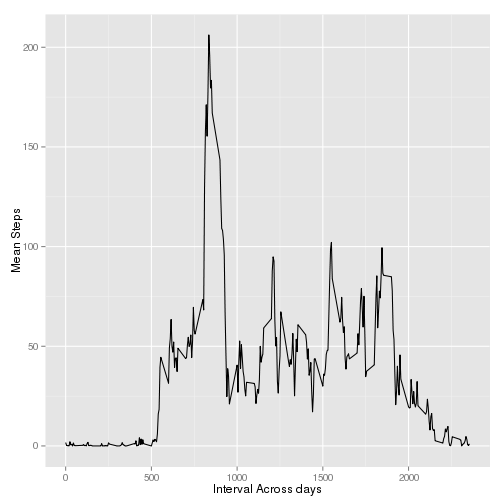
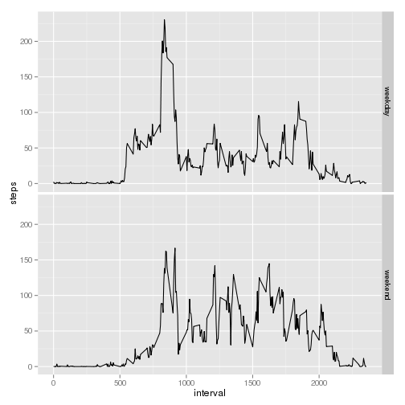

## Loading and preprocessing the data


```r
unzip(zipfile="activity.zip")

activity.raw.df <- read.csv(file="activity.csv")
activity.df<-activity.raw.df[complete.cases(activity.raw.df),]
steps_per_day<-tapply(activity.df$steps,activity.df$date,sum)
steps_per_day_complete<-steps_per_day[complete.cases(steps_per_day)]

steps_per_day.df<-as.data.frame(steps_per_day_complete)
steps_per_day.df$day<-names(steps_per_day_complete)
```

## What is mean total number of steps taken per day?

### Mean and Median steps per day

```r
summary(steps_per_day.df)
```

```
##  steps_per_day_complete     day           
##  Min.   :   41          Length:53         
##  1st Qu.: 8841          Class :character  
##  Median :10765          Mode  :character  
##  Mean   :10766                            
##  3rd Qu.:13294                            
##  Max.   :21194
```


```r
hist(steps_per_day.df$steps_per_day_complete, breaks=10)
```

 


## What is the average daily activity pattern?


```r
library(ggplot2)

mean_steps_across_day<-as.data.frame(tapply(activity.df$steps,activity.df$interval,mean) )
mean_steps_across_day$interval<-as.integer(rownames(mean_steps_across_day))
names(mean_steps_across_day)=c("steps_mean","interval")
qplot(data=mean_steps_across_day, mean_steps_across_day$interval, mean_steps_across_day$steps_mean, geom="line", xlab="Interval Across days", ylab="Mean Steps")
```

 

### On average across all the days in the dataset,  which contains the maximum number of steps: 

```r
mean_steps_across_day[max(mean_steps_across_day$steps) ==mean_steps_across_day$steps,]
```

```
##     steps_mean interval
## 835   206.1698      835
```

## Imputing missing values

```r
num_missing<-summary(!complete.cases(activity.raw.df))
num_missing
```

```
##    Mode   FALSE    TRUE    NA's 
## logical   15264    2304       0
```

### Number of rows with NAs = 2304

### Creating a filled dataset. When steps value is NA for an interval, use mean for that 5-minute interval previously calculated.

```r
activity.filled.df<-activity.raw.df

#Loop through intervals which contain NAs
for( intrvl in unique(activity.filled.df[
                which(is.na(activity.filled.df$steps)),]$interval) 
     )
  
{ 
  #For given interval, update all NAs to the mean.
activity.filled.df[is.na(activity.filled.df$steps) & activity.filled.df$interval==intrvl,]$steps <- 
  mean_steps_across_day[mean_steps_across_day$interval==intrvl, "steps_mean"] 
}

#create histogram of steps
filled_steps_per_day<-tapply(activity.filled.df$steps,activity.filled.df$date,sum)
filled_steps_per_day.df<-as.data.frame(filled_steps_per_day)
filled_steps_per_day.df$day<-names(filled_steps_per_day)

hist(filled_steps_per_day.df$filled_steps_per_day, breaks=10)
```

 

### Mean and Median complete steps per day

```r
summary(filled_steps_per_day.df)
```

```
##  filled_steps_per_day     day           
##  Min.   :   41        Length:61         
##  1st Qu.: 9819        Class :character  
##  Median :10766        Mode  :character  
##  Mean   :10766                          
##  3rd Qu.:12811                          
##  Max.   :21194
```

### The values differ only slightly from the estimates on the first part of the assignment.  The impact of imputing missing data on the estimates of the total daily number of steps shows a higher frequency of the mean value.  This is expected since entire days were missing step data and therefore would get the mean value for each interval in that day.

## Are there differences in activity patterns between weekdays and weekends?

```r
activity.filled.df$day_type<-weekdays(as.Date(activity.filled.df$date))
activity.filled.df[ activity.filled.df$day_type %in% c("Saturday", "Sunday"), ]$day_type<-"weekend"
activity.filled.df[ activity.filled.df$day_type %in% c("Monday", "Tuesday","Wednesday","Thursday","Friday"), ]$day_type<-"weekday"

#aggregate across intervales and then day_type (i.e. weekend or not)
activity.day_type.df<-aggregate(data=activity.filled.df, steps~interval*day_type,mean)

#plotting
sp <-ggplot(data=activity.day_type.df, aes(x=interval,y=steps)) + geom_line(shape="l")
sp <- sp+ facet_grid(day_type~.)
print(sp)
```

 

### Yes.  The difference is that on the weekend, more steps are taken,  on average, after 10am.   
